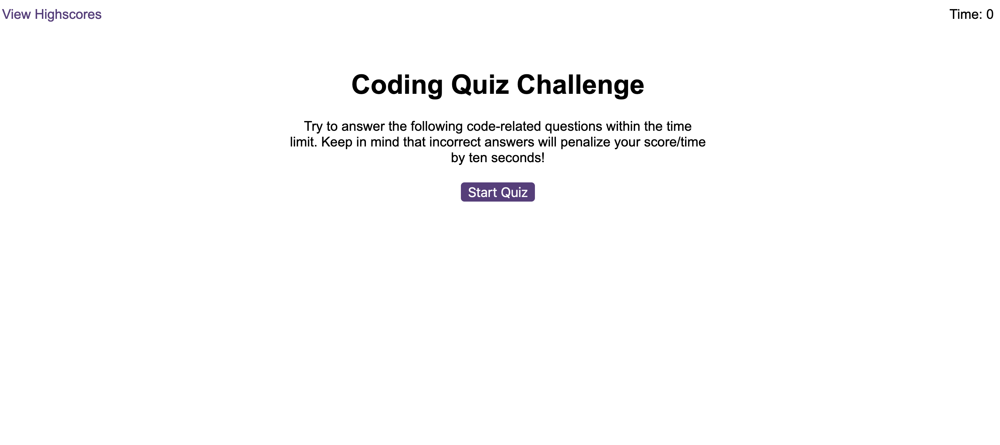
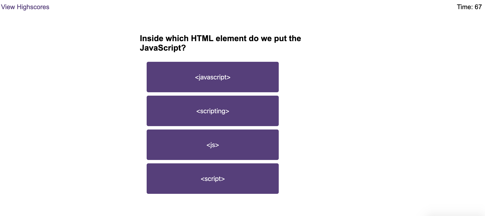
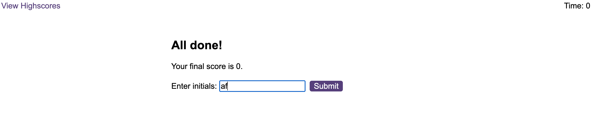

# <Code-Quiz>

## Description

This is a project creating a quiz using javascript to create the questions and answers dynamically. There is a timer function which deducts points for incorrect answers, and stores the remaining time as the final score. There is a score board which allows users to save scores. 

Skills Used:
* javascript
* css
* DOM manipulation

## Installation

N/A

## Usage

Link to deployed page: https://reets93.github.io/code-quiz/ 

This quiz is built using JavaScript and will work in browser - Google Chrome is recommended. 

## License

MIT license. Please refer to license information in repository.